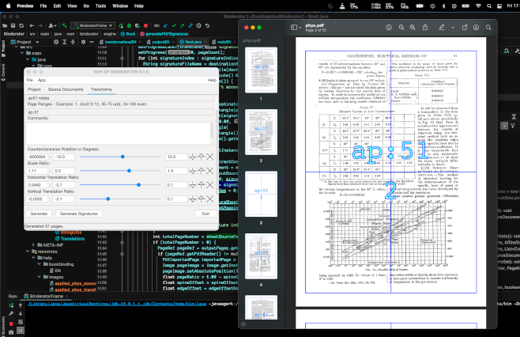

<head>
<meta name="google-site-verification" content="sLixbRzRz0FD5QFev5FydlhliZZirqWy-iW2nCFFKiw" />
</head>

# Son of Binderator

Son of Binderator (SOB) is a java-based tool to clean up PDFs (scanned or generated)
into a form suitable for printing, either as a simple document or in binding signatures (sections).
Arbitrary page ranges can be transformed with rotation, cropping, x/y translation or scaling.

To install and run,
<a href="https://www.oracle.com/au/java/technologies/downloads/">download and install Java 19</a>
and then either
<a href="https://github.com/31sv0g3l/sob/releases">download a runnable release jar</a>
and double click on that, or check out the source and build the maven package target to produce a runnable jar.

All documentation is inline.

